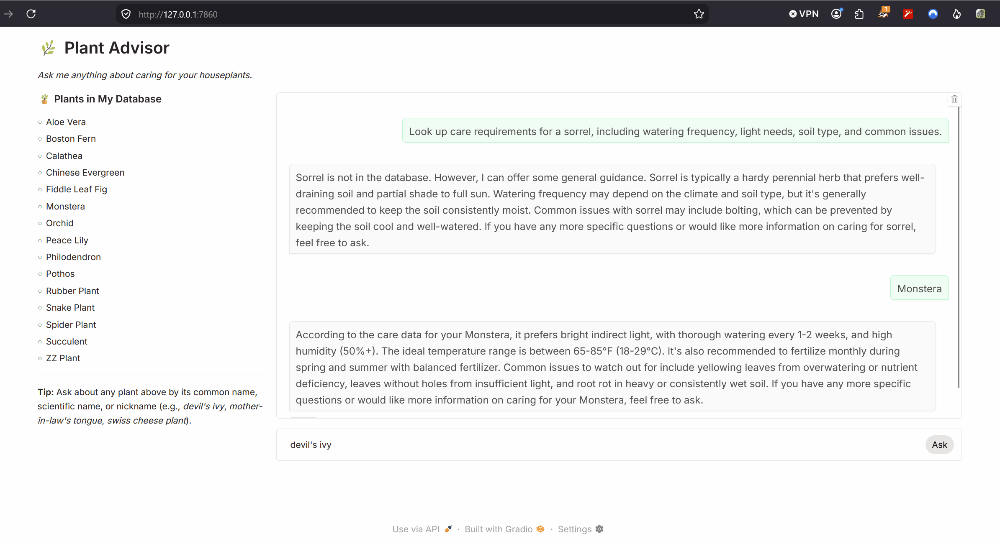

# Plant Advisor — AI201 Lab 2 Starter

# 👉 [Read Me](README.md) | [AI Bill of Materials (AI-BOM)](AIBOM.md) | [Model Card](model_card.md) |

A conversational agent that helps users care for their houseplants. Ask it anything about a plant in its database and it will look up the care requirements, check the current seasonal context, and give you specific, grounded advice.

The app is built and running. The agent isn't functional yet — that's the lab.



---

## Setup

**1. Fork and clone this repo.**

**2. Create and activate a virtual environment:**

```bash
python -m venv .venv
source .venv/bin/activate      # Mac/Linux
# or: .venv\Scripts\activate   # Windows
```

**3. Install dependencies:**

```bash
pip install -r requirements.txt
```

**4. Add your Groq API key.** Copy `.env.example` to `.env` and paste in your key from [console.groq.com](https://console.groq.com).

**5. Run the app:**

```bash
python app.py
```

Plant Advisor will open in your browser. The chat interface works, but the agent returns a placeholder message until you complete Milestone 2.

---

## Project Structure

```
ai201-lab2-plantadvisor-starter/
├── app.py              ← Gradio UI (complete — do not modify)
├── config.py           ← API keys and settings (complete)
├── agent.py            ← Tool definitions + run_agent() to implement
├── tools.py            ← lookup_plant() and get_seasonal_conditions() to implement
├── data/
│   ├── plants.json     ← 15-plant database (complete)
│   └── seasons.json    ← Seasonal care data (complete)
├── specs/
│   ├── system-design.md        ← Start here
│   ├── tool-functions-spec.md  ← Complete before Milestone 1
│   └── agent-loop-spec.md      ← Complete before Milestone 2
└── requirements.txt
```

## Where to Start

Open `specs/system-design.md`. Read the whole thing before opening any code file.

## Security Tools 
Phase 1 : Static Application Security Testing (SAST)
- Bandit (Python Security Scanner)
    - pip install bandit
    - Run scan and save HTML report
    - bandit -r . -f html -o bandit_report.html
- Semgrep (Customable Pattern Matcher)
    - pip install semgrep
    - Run security rulesets
    - semgrep --config p/ci

Phase 2 : Dependency & CVE Scanning (Software Composition Analysis - SCA)
```
Scan project dependencies (requirements.txt) for known Common Vulnerabilities and Exposures (CVEs).
```
- pip-audit
    - pip-audit -r requirements.txt -f markdown -o cve_report.md
- Safety
    - pip install safety
    - safety check --full-report
    - safety check --full-report --output html > safety_report.md

Phase 3: Dynamic Application Security Testing (DAST)
```
OWASP ZAP (Zed Attack Proxy)
├── CI/CD Automation (GitHub Actions Workflow)
├── Addressing CVE Issues & Viewing Results in GUI Format
```
## STRIDE Threat Modeling Matrix

| Threat Category | Applied Risk in Plant Advisor | Mitigation Strategy |
| :--- | :--- | :--- |
| **Spoofing** | Unauthorized API usage or fake client calls. | Enforce environment-variable-backed API authentication; secure web UI ports. |
| **Tampering** | Prompt injection changing tool parameters. | Enforce rigid type constraints in function parameter schemas. |
| **Repudiation** | Inability to track unhandled errors or invalid requests. | Implement explicit console logger (dispatch_tool execution logging). |
| **Information Disclosure** | Exposing GROQ_API_KEY or stack traces in Web UI. | Mask API keys in UI/logs; catch exceptions gracefully in agent loop. |
| **Denial of Service** | Infinite tool execution loops draining API credits. | Explicit MAX_TOOL_ROUNDS = 5 circuit breaker. |
| **Elevation of Privilege** | Execution of unauthorized local code via tool inputs. | Restrict tools strictly to local dictionary lookups; avoid eval(). |
